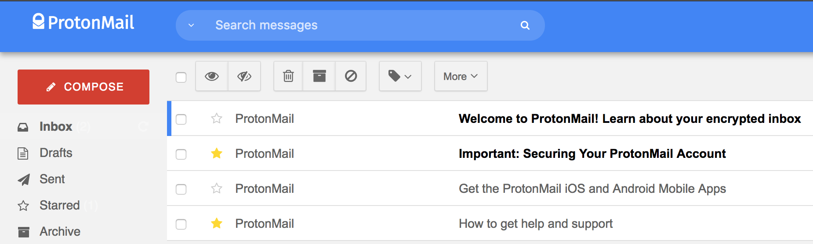
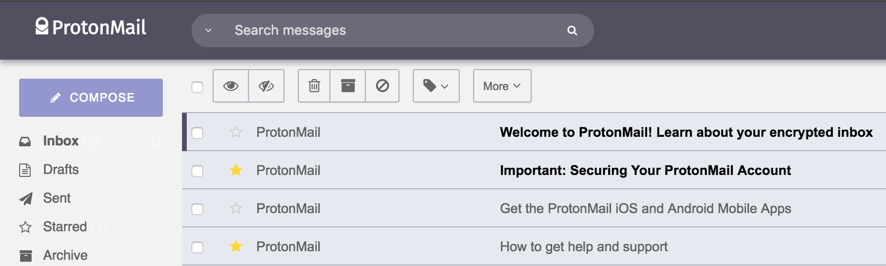
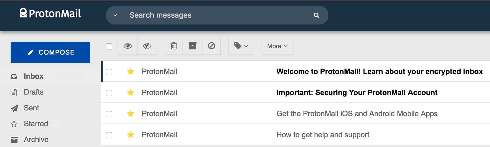
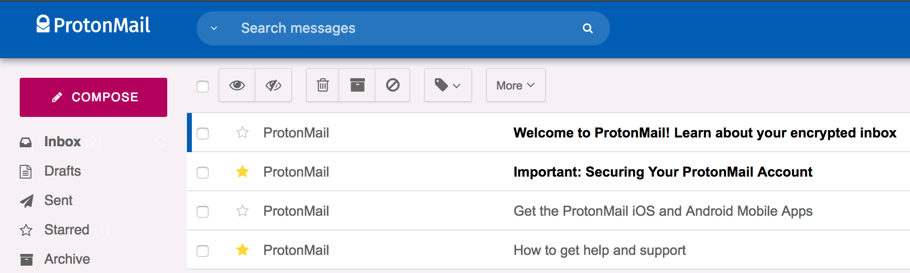
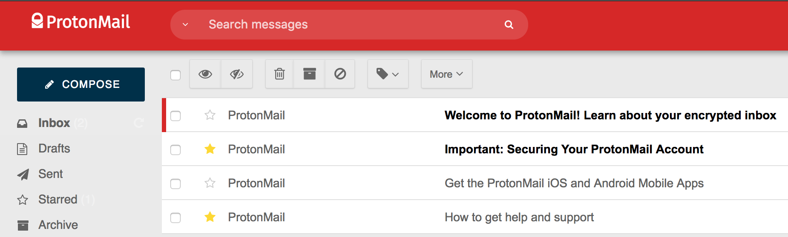

Inbox ProtonMail theme
======================

A light and clear theme for ProtonMail, inspired by Google Inbox, with several color styles.

To install it, copy the whole CSS in *dist/pm-inbox-xxxxx-theme.css* (replace xxxxx with the style you choose, see below), open your ProtonMail account settings, select the *Appearance* tab, and paste the CSS into the *Custom theme* field.

This is based on [Austin Delamar's work](https://github.com/amdelamar/pm-theme).

Several styles are provided, feel free to create (and submit me by pull request) your own!

## Styles

### [Google](https://github.com/scastiel/pm-inbox-theme/tree/master/dist/pm-inbox-google-theme.css)

### [Proton](https://github.com/scastiel/pm-inbox-theme/tree/master/dist/pm-inbox-proton-theme.css)

### [Detchem](https://github.com/scastiel/pm-inbox-theme/tree/master/dist/pm-inbox-detchem-theme.css)

### [Fornax](https://github.com/scastiel/pm-inbox-theme/tree/master/dist/pm-inbox-fornax-theme.css)

### [Reddy](https://github.com/scastiel/pm-inbox-theme/tree/master/dist/pm-inbox-reddy-theme.css)

