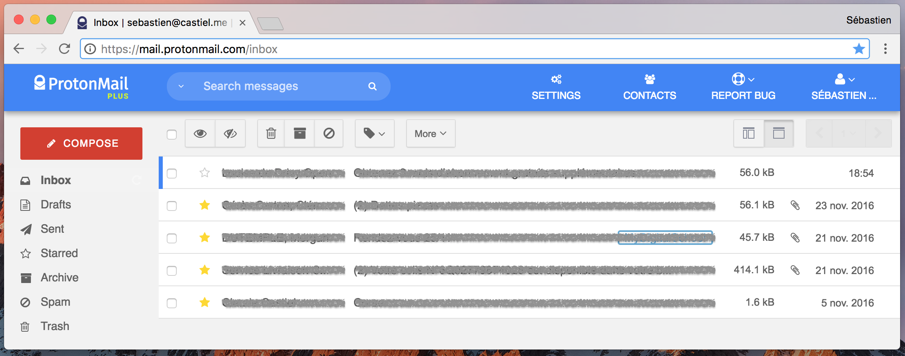

Inbox ProtonMail theme
======================

A light and clear theme for ProtonMail, inspired by Google Inbox.

To install it, copy the whole CSS in *dist/pm-inbox-theme.css*, open your ProtonMail account settings, select the *Appearance* tab, and paste the CSS into the *Custom theme* field.

This is based on [Austin Delamar's work](https://github.com/amdelamar/pm-theme).

Feel free to modify it to fit your needs!
